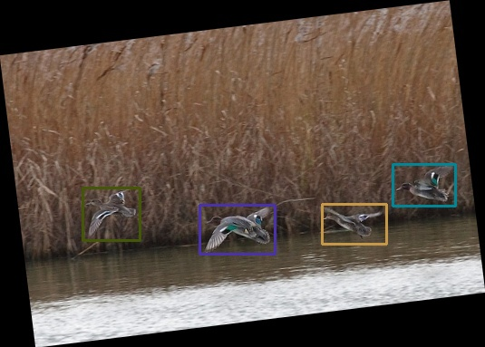
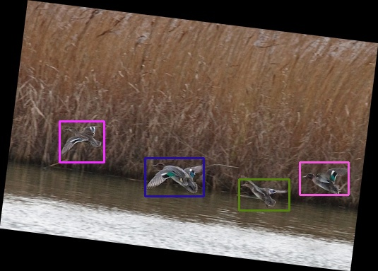
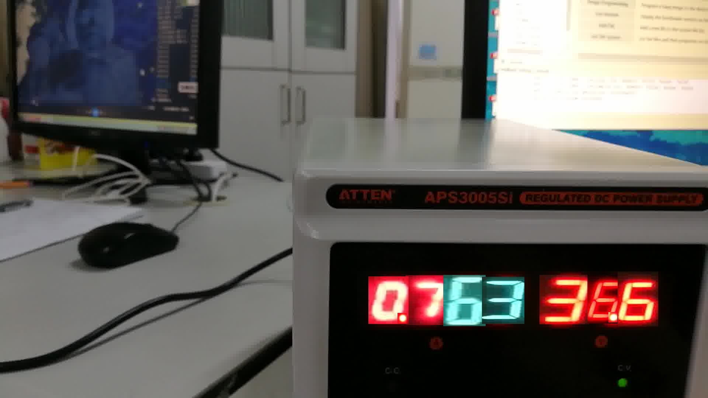

# data-processing
Personal tools for processing deep learning data(VOC2007，CSV)

- ### 镜像
augmented_data/mirror.py   

- ### 仿射变换
augmented_data/warp.py  
augmented_data/showBBox.py  

- ### 生成新图片
augmented_data/createNewImg.py
对数字仪表图片，将里面的数字都裁剪出来，随机缩放、旋转、噪声处理等，然后将不同的数字粘贴到某一个模板的显示屏上，以扩展数据集。  

- ### 标签信息 YOLO 格式转 VOC2007格式
yolo2voc.py

- ### 其他工具
tools/BaiduImageSpider/index.py：输入关键字，就爬百度图片下该关键字的图片  
tools/extract_frames/\*：用于对视频抽帧

